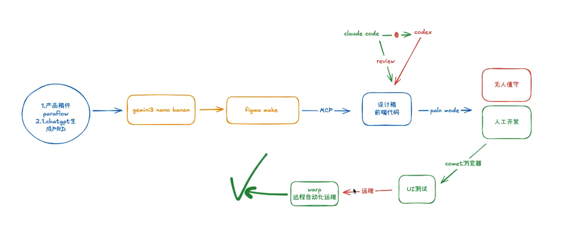

# 不要焦虑。AI 是你的外骨骼，不是你的竞争对手。你的核心竞争力在于对业务的深刻理解、工程架构经验以及对 AI 产出的鉴赏力。

从明天开始，把那些不想写的单元测试、不想看的旧代码文档交给 AI。从“手搓代码”的工匠，进化为“指挥 AI”的架构师。

webpack plugin 本地 ai codereview

## RAG
1. 用户问题
   ↓
2. 向量化（Embedding）
    + 把“人能理解的东西”（文字、图片、代码），变成“机器能比较远近的数字坐标”
   ↓
3. 向量检索（Top-K 文档）
   ↓
4. 构造 Prompt（上下文拼接）
   ↓
5. LLM 生成回答
   ↓
6. 解决了模型"不知道你私有数据"、"容易胡说"的问题

## Ollama
Ollama 是一个本地运行的大模型，支持多种模型，如 Llama2、ChatGLM 等。它的工作流程是先将用户的问题编码为向量，然后利用模型的编码器对向量进行编码，最后利用模型的解码器生成答案。

## 开源仓库
+ [AI文档检索大模型](https://github.com/Tencent/WeKnora/blob/main/README_CN.md)

## n8n

## difi

## AI编程
https://github.com/tukuaiai/vibe-coding-cn?tab=readme-ov-file

## ai和浏览器交互工具
1. chatgpt atlas
2. perplexity、comet

## 设计
1. paraflow
2. UI设计：figma make
3. paraflow生成产品稿、chatGpt生成prd -> gemini3 nano banan 生成图片 -> figma make 设计稿 -> 前端用figma mcp生成代码 -> comet浏览器 -> 测试 -> warp自动化运维

4. 通过monorepo管理项目代码，避免重复

## 团队使用ai如何保证代码一致性
1. subagent

## NotebookLM
+ 基于我上传的资料进行问答，减少ai幻觉
+ 学习油管视频
+ 生成ai播客
+ ppt转换为视频
+ 视频转文字稿

