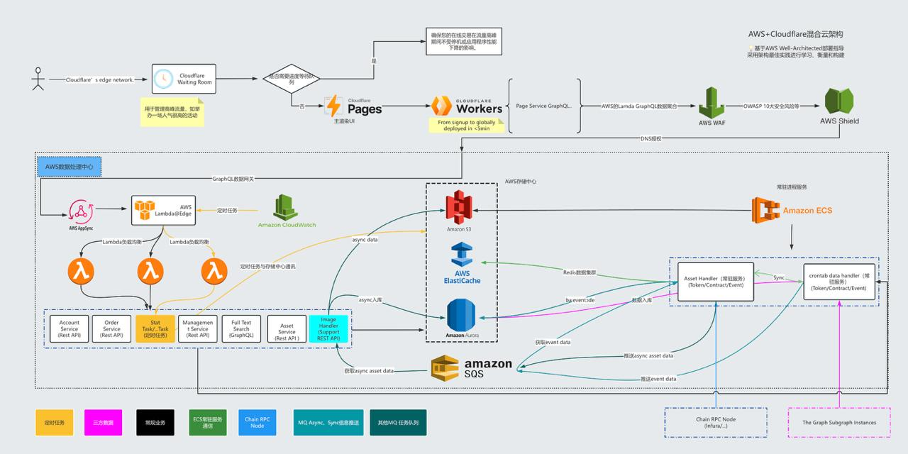

# 半中心化前端架构部署方案

> 创建日期：2026-02-21  
> 分类：工程化 / 前端架构 / 部署

---

## 架构图

---

## 方案概述

这是一套**半中心化前端架构部署方案**，从前端到后端各层都有清晰的职责划分：

### 分层架构

1. **CDN** - 内容分发网络，加速静态资源访问
2. **ALB** - 应用负载均衡，流量分发
3. **WAF** - Web应用防火墙，安全防护
4. **API网关** - 统一入口，路由转发
5. **BFF** - Backend For Frontend，为前端定制后端
6. **Serverless** - 无服务器计算
7. **微服务** - 分散的业务逻辑
8. **中间件** - 消息队列、缓存等
9. **数据层** - 数据库、存储

---

## 更新记录

| 日期 | 内容 | 作者 |
|------|------|------|
| 2026-02-21 | 初始版本 | OpenClaw 助手 |

